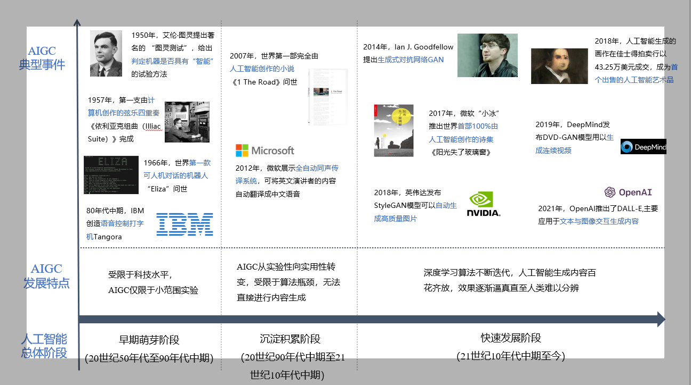
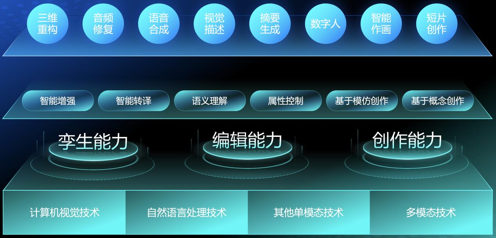
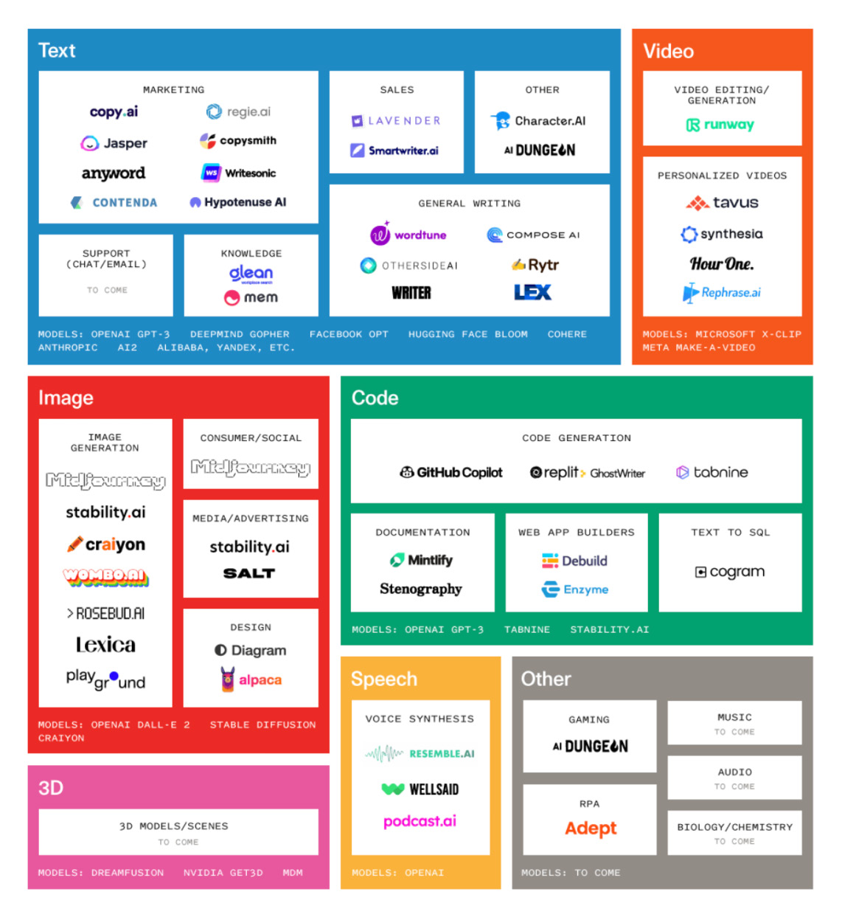
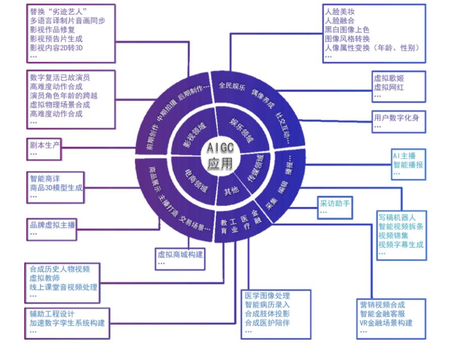

# AIGC

> Artificial Intelligence Generated Content
> 人工智能生成内容

[TOC]

 

## 发展历史沿革

+ 
+ 内容创作模式的四个发展阶段
  + $$\begin{gather*}
      \text{PGC} \to \text{UGC} \to \text{AIUGC} \to \text{AIGC}
      \end{gather*}$$
    + PGC &emsp; Professional Generated Content, 专业制作
    + UGC &emsp; User Generated Content, 用户创作
    + AIUGC &emsp; AI enabled User Generated Content, AI辅助用户创作

 

## 三大前沿能力

+ 

+ $$\begin{gather*}
    \text{AIGC技术演化出三大前沿能力}
    \begin{dcases}
    \text{智能数字内容孪生能力}
    \begin{dcases}
    \text{智能增强技术}
    \begin{dcases}
    \text{生成复原有缺陷的音频数据} \\
    \text{修复并增强受损的视觉内容} \\
    \cdots
    \end{dcases} \\
    \text{智能转译技术}
    \begin{dcases}
    \text{给定语音信号进行字幕合成} \\
    \text{依据文字进行语音生成} \\
    \cdots
    \end{dcases}
    \end{dcases} \\
    \text{智能数字内容编辑能力}
    \begin{dcases}
    \text{语义理解}
    \begin{dcases}
    \text{分离音频数据的人声信号和背景音} \\
    \text{图片、视频剪辑} \\
    \text{文本摘要生成} \\
    \cdots
    \end{dcases} \\
    \text{属性控制}
    \begin{dcases}
    \text{智能图像编辑} \\
    \text{文本情感改写} \\
    \text{智能调音} \\
    \cdots
    \end{dcases}
    \end{dcases} \\
    \text{智能数字内容创作能力}
    \begin{dcases}
    \text{作画} \\
    \text{旋律创作} \\
    \text{文本写作} \\
    \text{诗词创作} \\
    \cdots
    \end{dcases}
    \end{dcases}
    \end{gather*}$$

 

## 技术和产业生态

### 技术积累融合

+ $$\begin{gather*}
    \begin{drcases}
    \text{GAN} \\
    \text{Diffusion} \\
    \text{Transformer} \\
    \text{CLIP} \\
    \cdots
    \end{drcases}
    \text{预训练模型} \to \text{AIGC}
    \end{gather*}$$
  + | 模型 | 提出时间 | 模型描述 |
    | --- | --- | --- |
    | 生成对抗网络（Generative Adversarial Network, GAN） | 2014年 | 基于对抗的生成—鉴别（Generator-Discriminator）模型对。 |
    | 扩散模型（Diffusion Model） | 2015年 | 扩散模型有两个过程，分别为扩散过程和逆扩散过程。在前向扩散阶段对图像逐步施加噪声，直至图像被破坏变成完成的高斯噪声，然后在逆向阶段学习从高斯噪声还原为原始图像的过程。 经过训练，该模型可以应用这些去噪方法，从随机输入中合成新的“干净”数据。 |
    | Transformer | 2017年 | 一种基于自注意力机制的神经网络模型，最初用来完成不同语言之间的文本翻译任务，主题包括Encoder和Decoder部分，分别负责对源语言文本进行编码和将编码信息转换为目标语言文本。 |
    | 跨模态深度学习模型（Contrastive Language-Image Pre-Training, CLIP） | 2021年 | 1、进行自然语言理解和计算机视觉分析； 2、使用已经标记好的“文字—图像”训练数据。一方面对文字进行模型训练。一方面对另一个模型的训练，不断调整两个模型的内部参数，使得模型分别输出的文字特征和图像特征值并确认匹配。 |

 

+ 国外主要的AIGC预训练模型
  + | | 预训练模型 | 应用 | 领域 |
    | --- | --- | --- | ---|
    | 谷歌 | BERT LaMDA PaLM Imagen Parti | 语言理解与生成 对话系统 语言理解与生成、推理、代码生成 语言理解与图像生成 语言理解与图像生成 | NLP NLP NLP 多模态 多模态 |
    | 微软 | Florence Turing-NLG | 视觉识别 语言理解、生成 | CV NLP |
    | Facebook | OPT-175B M2M-100 | 语言模型 100种语言互译 | NLP NLP |
    | Deep Mind | Gato Gopher AlphaCode | 多面手的智能体 语言理解与生成 代码生成 | 多模态 NLP NLP |
    | Open AI | GPT3 CLIP&DALL-E Codex ChatGPT | 语言理解与生成、推理等 图像生成、跨模态检索 代码生成 语言理解与生成、推理等 | NLP 多模态 NLP NLP |
    | 英伟达 | Megatron-Turing NLG | 语言理解与生成、推理 | NLP |
    | Stability AI | Stable Diffusion | 语言理解与图像生成 | 多模态 |

 

+ 国外应用现状概览
  + 
    + Text
      + | AREA | APPLICATION |
        | --- | --- |
        | MARKETING | [copy.ai](https://www.copy.ai/) [regie.ai](https://www.regie.ai/) [Jasper](https://www.jasper.ai/) [copysmith](https://copysmith.ai/) [anyword](https://anyword.com/) [Writesonic](https://writesonic.com/) [CONTENDA](https://contenda.co/) [Hypotenuse AI](https://www.hypotenuse.ai/) |
        | SALES | [LAVENDER](https://www.lavender.ai/) [Smartwriter.ai](https://www.smartwriter.ai/) |
        | KNOWLEDGE | [glean](https://glean.co) [mem](https://get.mem.ai/) |
        | GENERAL WRITING | [wordtune](https://www.wordtune.com/) [COMPOSE AI](https://www.compose.ai/) [OTHERSIDEAI $\to$ HyperWrite](https://www.hyperwriteai.com/) [Rytr](https://rytr.me/)   [WRITER](https://writer.com/) [LEX](https://lex.page/) |
        | OTHER | [~~Character.AI~~](https://beta.character.ai/) [AI DUNGEON](https://aidungeon.io/) |
      + MODELS
        + OPENAI GPT-3
        + DEEPMIND GOPHER
        + FACEBOOK OPT
        + HUGGING FACE BLOOM
        + COHERE
        + ANTHROPIC
        + AI2
        + ALIBABA
        + YANDEX 
    + Code
      + | AREA | APPLICATION |
        | --- | --- |
        | CODE GENERATION | [GitHub Copilot](https://github.com/features/copilot) [replit: GhostWriter](https://replit.com/site/ghostwriter) [tabnine](https://www.tabnine.com/) |
        | DOCUMENTATION | [Mintlify](https://mintlify.com/) [Stenography](https://www.stenography.dev/) |
        | WEB APP BUILDERS | [Debuild](https://debuild.app/) [Enzyme](https://enzyme.so/) |
        | TEXT TO SQL | [cogram](https://www.cogram.com/) |
      + MODELS
        + OPENAI GPT-3 
        + TABNINE
        + STABILITY.AI
    + Image
      + | AREA | APPLICATION |
        | --- | --- |
        | IMAGE GENERATION | [Midjourney](https://www.midjourney.com/) [stability.ai](https://stability.ai/) [craiyon](https://www.craiyon.com/) [WOMBO.AI](https://www.wombo.art/)[ROSEBUD.AI](https://www.rosebud.ai/) [Lexica](https://lexica.art/) [playground](https://playgroundai.com/) |
        | CONSUMER / SOCIAL | [Midjourney](https://www.midjourney.com/) |
        | MEDIA / ADVERTISING | [stability.ai](https://stability.ai/) |
        | DESIGN | [Diagram $\to$ draw.io](https://www.drawio.com/) [alpaca](https://www.alpacaml.com/) |
      + MODELS
        + OPENAI DALL-E 2
        + STABLE DIFFUSION
        + CRAIYON
    + Video
      + | AREA | APPLICATION |
        | --- | --- |
        | VIDEO EDITING / GENERATION | [runway](https://runwayml.com/) |
        | PERSONALIZED VIDEOS | [tavus](https://www.tavus.io/)  [synthesia](https://www.synthesia.io/) [Hour One](https://hourone.ai/)   [Rephrase.ai](https://www.rephrase.ai/) |
      + MODELS
        + MICROSOFT X-CLIP
        + META MAKE-A-VIDEO
    + 3D
      + MODELS 
        + DREAMFUSION
        + NVIDIA GET3D
        + MDM
    + Speech
      + | AREA | APPLICATION |
        | --- | --- |
        | VOICE SYNTHESIS | [RESEMBLE.AI](https://www.resemble.ai/) [WELLSAID](https://wellsaidlabs.com/) [podcast.ai](https://podcast.ai/) |
      + MODELS
        + OPENAI
    + Other
      + | AREA | APPLICATION |
        | --- | --- |
        | GAMING | [AI DUNGEON](https://aidungeon.io/) |
        | RPA | [Adept](https://www.adept.ai/) |

 

## 应用场景

+ 

 

### 各行业领域

+ 传媒
  + $$\begin{align*}
      \text{采编环节} &
      \begin{dcases}
      \text{采访录音语音转写} \\
      \text{智能新闻写作} \\
      \text{智能视频剪辑}
      \begin{dcases}
      \text{视频字幕生成} \\
      \text{视频锦集} \\
      \text{视频拆条} \\
      \text{视频超分}
      \end{dcases}
      \end{dcases} \\
      \text{传播环节} &
      \begin{drcases}
      \begin{dcases}
      \text{实时语音} \\
      \text{人物动画}
      \end{dcases}
      \end{drcases}
      \text{智能合成主播}
      \end{align*}$$

 

+ 电商
  + $$\begin{align*}
      & \text{商品三维模型} \\
      & \text{虚拟主播} \\
      & \text{虚拟货场}
      \end{align*}$$

 

+ 影视
  + $$\begin{align*}
      & \text{剧本创作} \\
      & \text{合成人脸} \\
      & \text{合成声音} \\
      & \text{合成虚拟物理场景} \\
      & \text{修复还原影视图像} \\
      & \text{影视预告片生成} \\
      & \text{影视内容从二维向三维自动转制}
      \end{align*}$$

 

+ 娱乐
  + $$\begin{align*}
      & \text{趣味性图像或音视频生成} \\
      & \text{打造虚拟偶像} \\
      & \text{开发个人用户数字化身}
      \end{align*}$$

 

+ 教育
  + $$\begin{align*}
      & \text{制作历史人物} \\
      & \text{合成逼真的虚拟教师}
      \end{align*}$$

 

+ 金融
  + $$\begin{align*}
      & \text{自动化生产金融咨询、产品介绍} \\
      & \text{视听双通道的虚拟数字人客服}
      \end{align*}$$

 

+ 医疗
  + $$\begin{align*}
      & \text{改善医学图像质量} \\
      & \text{录入电子病历} \\
      & \text{为失声者合成语言音频} \\
      & \text{为残疾者合成肢体投影} \\
      & \text{为心理疾病患者合成无攻击感的医护陪伴}
      \end{align*}$$

 

+ 工业
  + $$\begin{align*}
      & \text{自动化工程设计中的任务} \\
      & \text{生成衍生设计} \\
      & \text{动态模拟} \\
      & \text{创建工厂、工业设备和生产线等的数字孪生系统}
      \end{align*}$$

 

### 应用工具

+ [AIGC导航](https://www.aigc.cn/)

 

## 参考文献

> [人工智能生成内容（AIGC）白皮书（2022年） 中国信息通信研究院,京东探索研究院 2022年9月](http://www.caict.ac.cn/kxyj/qwfb/bps/202209/P020220902534520798735.pdf)
> [腾讯研究院AIGC发展趋势报告2023](https://research.tencent.com/report?id=AJJ)
